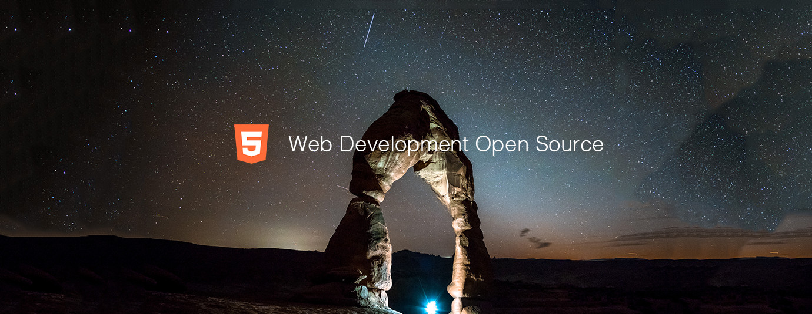

# Web Development Top 10 Open Source Projects for the Past Month (v.Jun 2018)

</a>

For the past month, we ranked nearly 200 Web Development Open Source Projects to pick the Top 10. 
We compared projects with new or major release during this period. Mybridge AI ranks projects based on a variety of factors to measure its quality for professionals.

* Average number of Github stars in this edition: 1,568 ⭐️
* Topics: Prerendering, Logger, Dune II, Critters, Database, VSCode, Mobile development, Openfl, Desktop Chat, PWA

Open source projects can be useful for programmers. Hope you find an interesting project that inspires you.

 

### Course of the month:

[A) Beginners: The Complete Web Developer in 2018: Zero to Mastery.](http://bit.ly/2sSZg5c) [7,492 recommends, 4.7/5 stars]

[B) Web Apps: Progressive Web Apps (PWA) — The Complete Guide.](http://bit.ly/2DGORkq) [2,707 recommends, 4.7/5 stars]

 

## Rank 1
### [Prerender-loader: Painless universal pre-rendering for Webpack.   [★1455]](https://github.com/GoogleChromeLabs/prerender-loader?utm_source=mybridge&utm_medium=blog&utm_campaign=read_more)

 

## Rank 2
### [Signale: Hackable console logger - Hackable and configurable to the core, signale can be used for logging purposes, status reporting, as well as for handling the output rendering process of other node modules and applications. [★5633]](https://github.com/klauscfhq/signale?utm_source=mybridge&utm_medium=blog&utm_campaign=read_more)

 

## Rank 3
### [OpenDUNE: An open source re-creation of the popular game "Dune II" [★1096]](https://github.com/OpenDUNE/OpenDUNE?utm_source=mybridge&utm_medium=blog&utm_campaign=read_more)

 

## Rank 4
### [Critters: A Webpack plugin to inline your critical CSS and lazy-load the rest [★1560]](https://github.com/GoogleChromeLabs/critters?utm_source=mybridge&utm_medium=blog&utm_campaign=read_more)

 

## Rank 5
### [Histore:  200b key-value store backed by navigation state [★604]](https://github.com/developit/histore?utm_source=mybridge&utm_medium=blog&utm_campaign=read_more)

 

## Rank 6
### [NIGHT OWL: A VS Code dark theme for contrast for nighttime coding  [★428]](https://github.com/sdras/night-owl-vscode-theme?utm_source=mybridge&utm_medium=blog&utm_campaign=read_more)

 

## Rank 7
### [Sonar: A desktop debugging platform for mobile developers. [★3084]](https://github.com/facebook/Sonar?utm_source=mybridge&utm_medium=blog&utm_campaign=read_more)

 

## Rank 8
### [Openfl v8.0: Interactive game and app development library for TS, Haxe, JS and AS3 [★1249]](https://github.com/openfl/openfl?utm_source=mybridge&utm_medium=blog&utm_campaign=read_more)

 

## Rank 9
### [Electron-desktop-chat: A desktop chat built with React, React Desktop and Electron](https://github.com/pusher/electron-desktop-chat?utm_source=mybridge&utm_medium=blog&utm_campaign=read_more)

 

## Rank 10
### [Pwa-starter-kit: Starter templates for building PWAs [★948]](https://github.com/polymer/pwa-starter-kit?utm_source=mybridge&utm_medium=blog&utm_campaign=read_more)

 

## Rank 1
### [Prerender-loader: Painless universal pre-rendering for weback.   [★1455]](https://github.com/GoogleChromeLabs/prerender-loader?utm_source=mybridge&utm_medium=blog&utm_campaign=read_more)

 

## Rank 2
### [Signale: Hackable console logger - Hackable and configurable to the core, signale can be used for logging purposes, status reporting, as well as for handling the output rendering process of other node modules and applications. [★5633]](https://github.com/klauscfhq/signale?utm_source=mybridge&utm_medium=blog&utm_campaign=read_more)

 

## Rank 3
### [OpenDUNE: An open source re-creation of the popular game "Dune II" [★1096]](https://github.com/OpenDUNE/OpenDUNE?utm_source=mybridge&utm_medium=blog&utm_campaign=read_more)

 

## Rank 4
### [Critters: A Webpack plugin to inline your critical CSS and lazy-load the rest [★1560]](https://github.com/GoogleChromeLabs/critters?utm_source=mybridge&utm_medium=blog&utm_campaign=read_more)

 

## Rank 5
### [Histore:  200b key-value store backed by navigation state [★604]](https://github.com/developit/histore?utm_source=mybridge&utm_medium=blog&utm_campaign=read_more)

 

## Rank 6
### [NIGHT OWL: A VS Code dark theme for contrast for nighttime coding  [★428]](https://github.com/sdras/night-owl-vscode-theme?utm_source=mybridge&utm_medium=blog&utm_campaign=read_more)

 

## Rank 7
### [Sonar: A desktop debugging platform for mobile developers. [★3084]](https://github.com/facebook/Sonar?utm_source=mybridge&utm_medium=blog&utm_campaign=read_more)

 

## Rank 8
### [Openfl v8.0: Interactive game and app development library for TS, Haxe, JS and AS3 [★1249]](https://github.com/openfl/openfl?utm_source=mybridge&utm_medium=blog&utm_campaign=read_more)

 

## Rank 9
### [Electron-desktop-chat: A desktop chat built with React, React Desktop and Electron](https://github.com/pusher/electron-desktop-chat?utm_source=mybridge&utm_medium=blog&utm_campaign=read_more)

 

## Rank 10
### [Pwa-starter-kit: Starter templates for building PWAs [★948]](https://github.com/polymer/pwa-starter-kit?utm_source=mybridge&utm_medium=blog&utm_campaign=read_more)

 

## Rank 1
### [Prerender-loader: Painless universal pre-rendering for weback.   [★1455]](https://github.com/GoogleChromeLabs/prerender-loader?utm_source=mybridge&utm_medium=blog&utm_campaign=read_more)

 

## Rank 2
### [Signale: Hackable console logger - Hackable and configurable to the core, signale can be used for logging purposes, status reporting, as well as for handling the output rendering process of other node modules and applications. [★5633]](https://github.com/klauscfhq/signale?utm_source=mybridge&utm_medium=blog&utm_campaign=read_more)

 

## Rank 3
### [OpenDUNE: An open source re-creation of the popular game "Dune II" [★1096]](https://github.com/OpenDUNE/OpenDUNE?utm_source=mybridge&utm_medium=blog&utm_campaign=read_more)

 

## Rank 4
### [Critters: A Webpack plugin to inline your critical CSS and lazy-load the rest [★1560]](https://github.com/GoogleChromeLabs/critters?utm_source=mybridge&utm_medium=blog&utm_campaign=read_more)

 

## Rank 5
### [Histore:  200b key-value store backed by navigation state [★604]](https://github.com/developit/histore?utm_source=mybridge&utm_medium=blog&utm_campaign=read_more)

 

## Rank 6
### [NIGHT OWL: A VS Code dark theme for contrast for nighttime coding  [★428]](https://github.com/sdras/night-owl-vscode-theme?utm_source=mybridge&utm_medium=blog&utm_campaign=read_more)

 

## Rank 7
### [Sonar: A desktop debugging platform for mobile developers. [★3084]](https://github.com/facebook/Sonar?utm_source=mybridge&utm_medium=blog&utm_campaign=read_more)

 

## Rank 8
### [Openfl v8.0: Interactive game and app development library for TS, Haxe, JS and AS3 [★1249]](https://github.com/openfl/openfl?utm_source=mybridge&utm_medium=blog&utm_campaign=read_more)

 

## Rank 9
### [Electron-desktop-chat: A desktop chat built with React, React Desktop and Electron](https://github.com/pusher/electron-desktop-chat?utm_source=mybridge&utm_medium=blog&utm_campaign=read_more)

 

## Rank 10
### [Pwa-starter-kit: Starter templates for building PWAs [★948]](https://github.com/polymer/pwa-starter-kit?utm_source=mybridge&utm_medium=blog&utm_campaign=read_more)

                    

