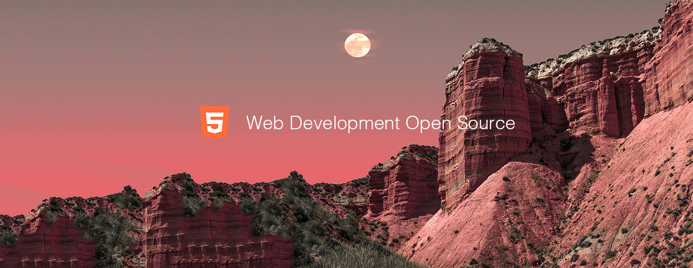

# Web Development Top 10 Open Source Projects for the Past Month (v.Jul 2018)

</a>

For the past month, we ranked nearly 200 Web Development Open Source Projects to pick the Top 10. 
We compared projects with new or major release during this period. Mybridge AI ranks projects based on a variety of factors to measure its quality for professionals.

* Average number of Github stars in this edition: 1,538 ⭐️
* Topics: TTY, CLI App, Components, Color Picker, Custom Element, Comlink, Http Requests, VSCode Highlighting, Favicon, Crosstab

Open source projects can be useful for programmers. Hope you find an interesting project that inspires you.

 

### Course of the month:

[A) Beginners: The Web Developer Bootcamp.](http://bit.ly/2EewLTH) [80,547 recommends, 4.7/5 stars]

[B) Web Design for Beginners: Real World Coding in HTML & CSS.](http://bit.ly/2FDTJEl) [3,459 recommends, 4.7/5 stars]

 

## Rank 1
### [Browsh v1.0: A fully-modern text-based browser, rendering to TTY and browsers [★7670]](https://github.com/browsh-org/browsh?utm_source=mybridge&utm_medium=blog&utm_campaign=read_more)

 

## Rank 2
### [Carbon-now-cli: Beautiful images of your code — from right inside your terminal. [★2120]](https://github.com/mixn/carbon-now-cli?utm_source=mybridge&utm_medium=blog&utm_campaign=read_more)

 

## Rank 3
### [Bit v13.0: Easily share code between projects with your team.  [★3515]](https://github.com/teambit/bit?utm_source=mybridge&utm_medium=blog&utm_campaign=read_more)

 

## Rank 4
### [Pickr: Flat, simple and hackable Color-Picker. No dependencies, no jQuery. Compatible with all CSS Frameworks e.g. Bootstrap, Materialize. [★1100]](https://github.com/Simonwep/pickr?utm_source=mybridge&utm_medium=blog&utm_campaign=read_more)

 

## Rank 5
### [Custom-elements-everywhere: Custom Element + Framework Interoperability Tests. [★312]](https://github.com/webcomponents/custom-elements-everywhere?utm_source=mybridge&utm_medium=blog&utm_campaign=read_more)

 

## Rank 6
### [Comlink-loader: Webpack loader to offload modules to Worker threads seamlessly using Comlink - GoogleChromeLabs [★281]](https://github.com/GoogleChromeLabs/comlink-loader?utm_source=mybridge&utm_medium=blog&utm_campaign=read_more)

 

## Rank 7
### [Statcode: Simply run $ statcode and get a quick explanation of your HTTP response, without leaving the terminal. [★222]](https://github.com/shobrook/statcode?utm_source=mybridge&utm_medium=blog&utm_campaign=read_more)

 

## Rank 8
### [Vscode-lit-html: Adds syntax highlighting for html inside of JavaScript and TypeScript tagged template strings [★132]](https://github.com/mjbvz/vscode-lit-html?utm_source=mybridge&utm_medium=blog&utm_campaign=read_more)

 

## Rank 9
### [Fonticon: Create beautiful favicons with ease. [★69]](https://github.com/devgg/FontIcon?utm_source=mybridge&utm_medium=blog&utm_campaign=read_more)

 

## Rank 10
### [Broadcast-channel: BroadcastChannel that works in New Browsers, Old Browsers, WebWorkers and NodeJs [★64]](https://github.com/pubkey/broadcast-channel?utm_source=mybridge&utm_medium=blog&utm_campaign=read_more)
